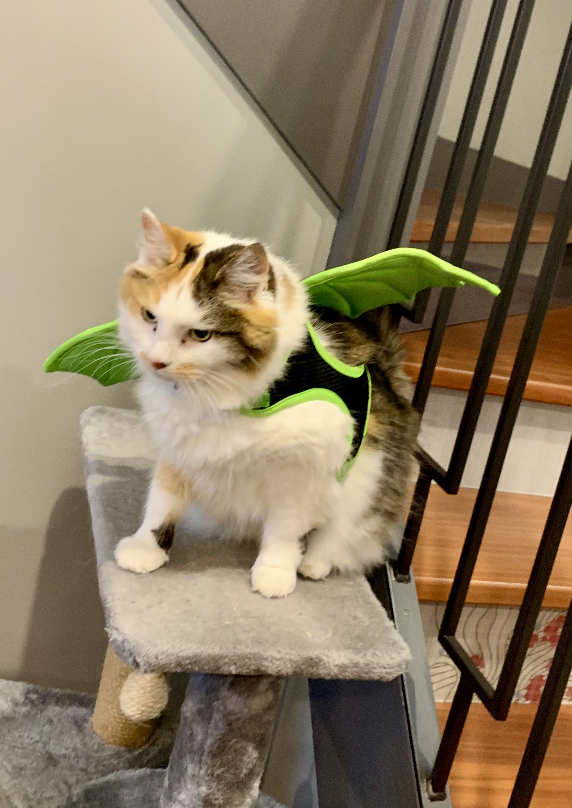

# Welcome to Cat Lore

For H and Scarlett, with ❤️

## Episodes

- [S01E01](/s01e01/)

# Publishing an episode

The first time publishing an episode:

- Export to web from Inky to `s0?e0?` folder
- Apply the customisations to style.css and main.js (see the S01E01 commit)

For subsequent story updates:

- Export Story.js from Inky

# S01E02

- Read through [The Intercept](https://www.inklestudios.com/ink/) example for game structure ideas
- Read through [Unity Integration](https://www.inklestudios.com/ink/) for ideas for future episodes
- `Functions.ink` is common and shared amongst stories
- Consider how to share some elements of the structure of the world between stories